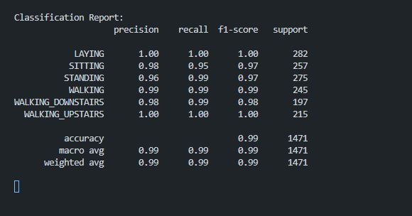
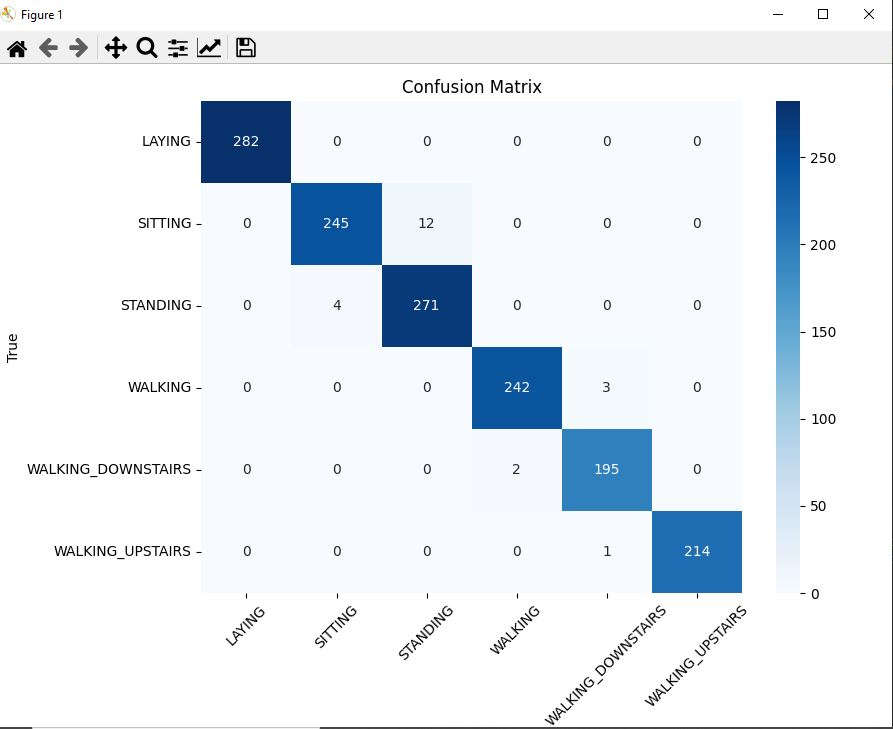
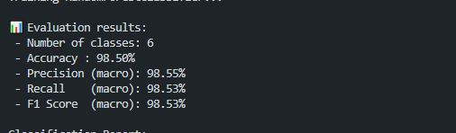

# 🧍 Human Activity Recognition using Random Forest 🤖  
      

<p align="center">
  
</p>

🚀 This project builds a **Random Forest classifier** to recognize human activities from smartphone sensor data. Using the UCI HAR dataset, it classifies six activities (walking, walking upstairs, walking downstairs, sitting, standing, laying) with **~99% accuracy**. The pipeline includes data preprocessing, feature scaling, model training, and comprehensive evaluation with confusion matrix and classification report.

---

## ✨ Key Features  
📊 **Data Exploration** – Handles multiple dataset formats (HAR, MNIST)  
⚙️ **Preprocessing** – Automatic label detection, missing value handling, feature scaling  
🧠 **Random Forest Classifier** – Ensemble learning for robust classification  
📈 **Model Evaluation** – Accuracy, precision, recall, F1‑score, and detailed classification report  
🎨 **Visualization** – Confusion matrix heatmap for performance insight  
🔄 **Flexible Script** – Works with any CSV dataset containing a label column  

---

## 🧠 Tech Stack  
- **Language:** Python 🐍  
- **Libraries:** pandas, numpy, scikit-learn, matplotlib, seaborn  
- **Model:** Random Forest Classifier (100 estimators)  
- **Preprocessing:** StandardScaler, LabelEncoder  
- **Evaluation:** Accuracy, Precision, Recall, F1‑Score, Confusion Matrix  

---

## 📦 Installation  

```bash
git clone https://github.com/SayabArshad/Human-Activity-Recognition-RandomForest.git
cd Human-Activity-Recognition-RandomForest
pip install pandas numpy scikit-learn matplotlib seaborn
````

⚙️ Note: The dataset (train.csv) is not included due to size. Download the UCI HAR dataset from Kaggle and place it in the project folder as train.csv.

---

## ▶️ Usage

Run the main script:

```bash
python handwritten_recognition.py
```
The script will automatically:

Locate and load the dataset.

Detect the label column.

Preprocess features (handle missing values, scale data).

Split into train/test sets.

Train a Random Forest model.

Print evaluation metrics and display a confusion matrix heatmap.

---

## 📁 Project Structure

```

Human-Activity-Recognition-RandomForest/
│-- handwritten_recognition.py         
│-- test.csv                           
│-- README.md                           
│-- assets/                              
│    ├── classification_report.JPG
│    ├── confusion_matrix.JPG
│    └── evaluation_result.JPG
```

---


## 🖼️ Interface Previews

| 📝 Classification Report | 📊 Confusion Matrix |
|:------------------------:|:-------------------:|
|  |  |

## 📈 Evaluation Results


---

## 💡 About the Project

Human Activity Recognition (HAR) is a key area in ubiquitous computing, with applications in healthcare, fitness tracking, and smart environments. This project demonstrates a complete machine learning pipeline on the UCI HAR dataset, which contains accelerometer and gyroscope data from smartphones. The Random Forest classifier achieves near‑perfect performance, correctly distinguishing between dynamic activities (walking, walking upstairs/downstairs) and static postures (sitting, standing, laying). The flexible script can easily be adapted to other CSV datasets (e.g., digit recognition) by simply pointing to the appropriate file.

---

## 🧑‍💻 Author

**Developed by:** [Sayab Arshad Soduzai](https://github.com/SayabArshad) 👨‍💻

📅 **Version:** 1.0.0

📜 **License:** MIT License

---

## ⭐ Contributions

Contributions are welcome! Fork the repository, open issues, or submit pull requests to enhance functionality (e.g., adding deep learning models, hyperparameter tuning, or building a real‑time prediction app).
If you find this project helpful, please ⭐ star the repository to show your support.

---

## 📧 Contact

For queries, collaborations, or feedback, reach out at **[sayabarshad789@gmail.com](mailto:sayabarshad789@gmail.com)**

---

📱 Recognizing human activities, one step at a time.

---
